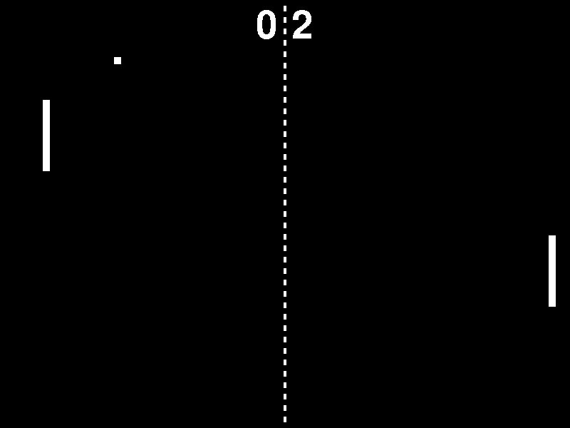
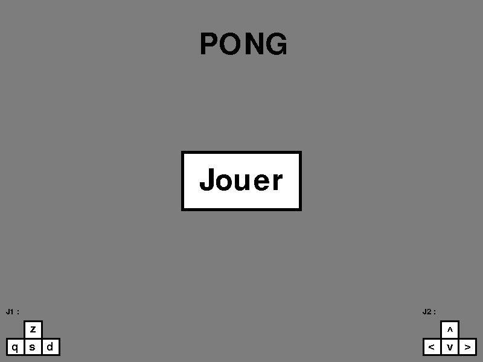
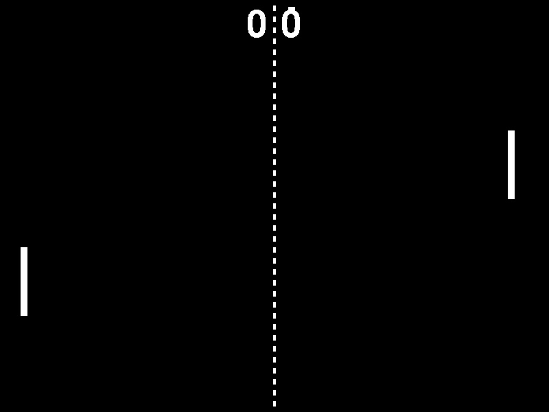

# Python-Pong-Game

This is a 2 players Pong game.
## Features
- 2 players game
- Scoring
## Installation
1. Download the repository by clicking on `Code > Download ZIP`
2. Extract the ZIP file
3. Run `main.pyw`
## Requirements
- Python 3.7
- Python `pygame` library
- Python `random` library
## Game Captures

